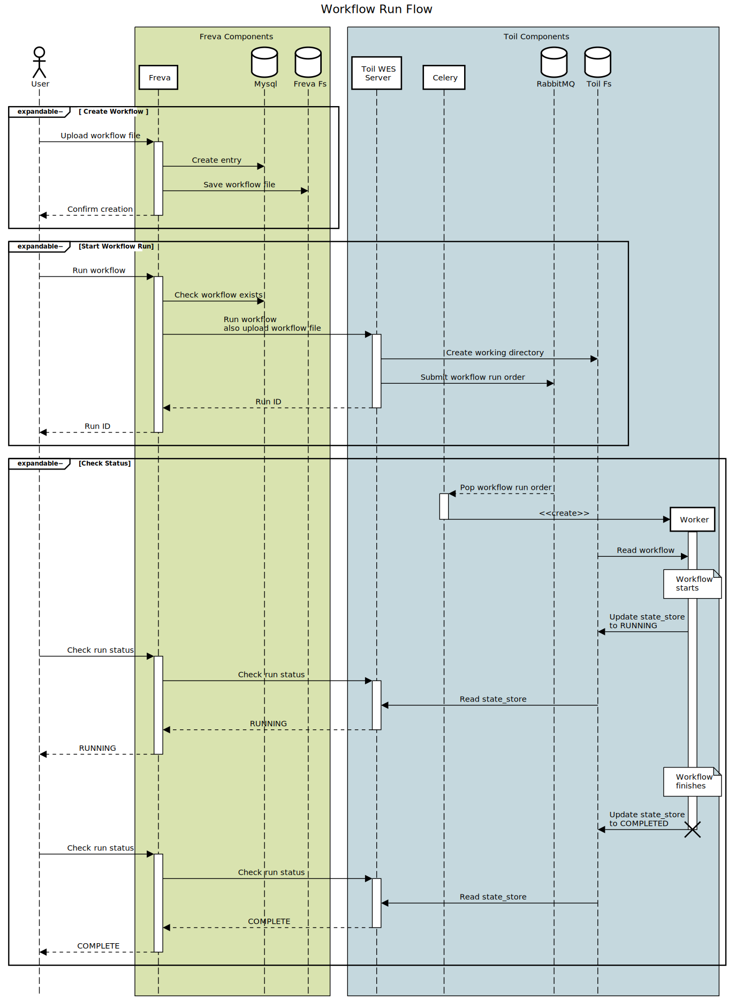

# Freva

Currently experimental redesign of Freva to use [CWL workflows](https://www.commonwl.org/).

It is built around [Toil](https://toil.readthedocs.io/en/latest/) and [Toil's
implementation](https://toil.readthedocs.io/en/latest/running/server/wes.html) of the [GA4GH Workflow Execution
Service](https://github.com/ga4gh/workflow-execution-service-schemas) spec. Freva's functionality overlaps somewhat with
Toil but differs in a few ways.

- Freva has authentication and permissions for running workflows
- Freva requires that all workflows are registered as a separate step from execution and only allows workflows that have
  been registered with it to run. Workflows which reference external resources will still work.

Freva's workflow management features have significant overlap with the goals of a [Tool Registry
Service](https://github.com/ga4gh/tool-registry-service-schemas) and it may change over time to align with that spec but
that is not a specific goal at this time.

# Quick Usage

Freva exposes a REST interface to create and run workflows. After creating a user, you can make and run a workflow
with a few HTTP requests.

```sh
# add example workflow to freva
❯ http -a '<username>:<password>' --multipart POST \
  localhost:8000/api/<username>/workflows name=hello-world \
  file@example-assets/workflows/hello-world.cwl

# run it and retrieve the id of the created run
❯ http -a '<username>:<password>' POST localhost:8000/api/runs/ --raw \
  '{
    "workflow_name": "hello-world",
    "inputs": {
      "message": "hello world!"
    }
  }'
{
  ...
  "id": "<run_id>",
}

# get the status of the run
❯ http -a '<username>:<password>' GET \
  localhost:8000/api/runs/<run_id>/status
```

For information on writing workflows, see the [CWL Getting Started guide](https://www.commonwl.org/user_guide/).

# Endpoints

Freva is still very much a work in progress so these endpoints will likely change over time.

## Workflows

| Endpoint                                    | Method | Description                                    |
| ------------------------------------------- | ------ | ---------------------------------------------- |
| `/api/<user>/workflows`                     | GET    | Lists all workflows created by `<user>`        |
| `/api/<user>/workflows`                     | POST   | Create a new workflow                          |
| `/api/<user>/workflows/<workflow>`          | GET    | Get information for `<workflow>`               |
| `/api/<user>/workflows/<workflow>/workflow` | GET    | Get the `<workflow>`'s CWL file                |
| `/api/<user>/workflows/<workflow>/workflow` | PUT    | Replace `<workflow>`'s CWL file with a new one |

## Runs

| Endpoint                 | Method | Description                                                            |
| ------------------------ | ------ | ---------------------------------------------------------------------- |
| `/api/runs`              | GET    | List all workflow runs                                                 |
| `/api/runs`              | POST   | Run a workflow                                                         |
| `/api/runs/<run>`        | GET    | Get information for `<run>`                                            |
| `/api/runs/<run>/status` | GET    | Get the information that Toil has about `<run>` which is more detailed |
| `/api/runs/<run>/stdout` | GET    | Get `<run>`'s `stdout` via Toil                                        |
| `/api/runs/<run>/stderr` | GET    | Get `<run>`'s `stderr` via Toil                                        |

# Development

The easiest method to create a development environment is the preconfigured [dev container](https://containers.dev/) if
your editor supports it. Otherwise you can use docker compose to run the database and Toil and use poetry to set up the
Python environment and its dependencies with

```sh
❯ docker compose up -d
❯ poetry shell
❯ poetry install
# initialize the database tables
❯ python manage.py migrate
# create an admin user, fill in whatever values you want for username and password
❯ python manage.py createsuperuser
...
❯ python manage.py runserver
```

The Freva server will listen on `http://localhost:8000`. Mysql will be accessible on `localhost:3306/freva`. If you need
to, you can communicate directly with Toil's WES on `http://localhost:8001` though this should only be necessary for
debugging.

## Testing

The API can be tested via Django's built-in testing feature.

```sh
❯ python manage.py test
```

# Workflow Flow

Freva uses Toil as the underlying engine to execute its workflows and Toil itself has several moving parts so here is
a sequence diagram of how the basic Freva actions move through the various components.


